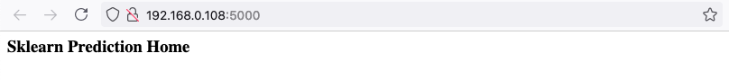
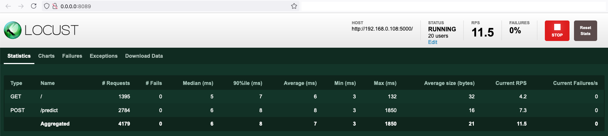

## Overview
In this project, I created a full CI/CD pipeline for a Flask-based machine learning application using:

GitHub Actions for Continuous Integration (CI)

Azure Pipelines for Continuous Delivery (CD)

Azure App Service for hosting the app

The project includes:

Automated linting, testing, and packaging

Deployment to Azure on every code change

A Makefile and Bash scripts for reproducible workflow


### Architecture CI/CD Workflow:

Developer pushes code to GitHub.

GitHub Actions runs make all (install → lint → test).

If CI passes, Azure Pipelines builds and deploys the app to Azure App Service.


## Instructions
### Create GitHub Actions Workflow
1. Go to your GitHub Repo
2. Got to Actions
3. Go to 'New workflow' and 'set up a new workflow yourself'
4. Configure your YML file as such:
```
name: Python application test with Github Actions

on: [push]

jobs:
  build:

    runs-on: ubuntu-latest

    steps:
    - uses: actions/checkout@v2
    - name: Set up Python 3.10.18
      uses: actions/setup-python@v1
      with:
        python-version: 3.10.18
    - name: Install dependencies
      run: |
        make install
    - name: Lint with pylint
      run: |
        make lint
    - name: Test with pytest
      run: |
        make test
```
5. Verify your successfull run in 'All Workflows'

A prerequisite for having a successfull CI workflow in GitHub Actions is a 'Makefile' and a 'requirements.txt'. In this project, I will only use pylint for code testing, not pytest. In the requirements file, you need to state the python libraries that are needed to get the Flask web app running. With this in place, a new push to the GitHub repo will automatically trigger the CI workflow in GitHub Actions (testing the app.py file). A pylint score below 10 will result in a failed CI build. That's the sign to refactor your code according to the pylint standards.


### Deploy the Flask Web App in Azure Cloud Shell
1. Launch an Azure Cloud Shell Environment, create ssh keys and upload them into your GitHub account.
````
ssh-keygen -t rsa <email>
````
2. Clone the GitHub project into your Azure Cloud Shell environment.
````
git clone git@github.com:Reem8534/Azure102.git
````


3. CD into your project directory and create the Python virtual environment via the Makefile.
```
make setup
```
4. Activate the Python virtual environment.
```
source ~/.udacity-devops/bin/activate
```
5. Install dependencies (pip & requirements) in the Python virtual environment and run CI part (only linting).
```
make all
```

output of install 

6. Start Flask web app
```
python app.py
```


7. Open second Azure Cloud Shell terminal and test the app by making a prediction
```
./make_prediction.sh
```


### Deploy the Flask Web App to Azure App Service
1. Create an Azure App Service in your Azure Cloud Shell environment
```
az webapp up -n <web name> -g <resource group>
```
Once, this step is successfully done, you should see the Azure App Service in your resource group.


2. Create a new project in Azure DevOps
3. Create a new service connection in Azure DevOps (you can find it under project settings). The Azure Resource Manager comes in handy for that. Choose Service principal (automatic) if asked and establish a connection to your subscription and resource group.
   
5. Go to Azure DevOps Pipelines and create one by connecting it to your GitHub repo. Once, you can configure your pipeline, choose 'Python to Linux Web App on Azure'. This will generate the appropriate YML file for the Flask web app.\
Once, this step is successfully done, you have deployed the Flask Web App.


5. Test the Flask Web App
```
./make_predict_azure_app.sh 
```


6. Logs can be found here:
```
az webapp log tail -n <web name> -g <resource group>
```


### Locust
Locust is an open source load-testing tool written in Python. It lets you write tests against your web application which mimic your user's behavior, and then run the tests at scale to help find bottlenecks or other performance issues.

1. Install locust on your local machine
```
pip install locust
```
2. Start your Flask Web App on your local machine
```
python app.py
```
3. Start locust
```
locust
```

A prerequisite is a seperate locustfile.py in your directory.\
Once your start locust, two tabs will open:




In the latter one, you can enter the total number of users, the spawn rate and the host (in my case: localhost). The screenshot shows the result of the swarming (the result of the load test).

## Enhancements
A valuable improvement would be to streamline the entire CI/CD process using only Azure DevOps—by leveraging Azure Repos for source control and Azure Pipelines for both CI and CD. This approach avoids the complexity of splitting responsibilities between GitHub (for CI via Actions) and Azure DevOps (for CD), making the workflow more cohesive and easier to manage.
